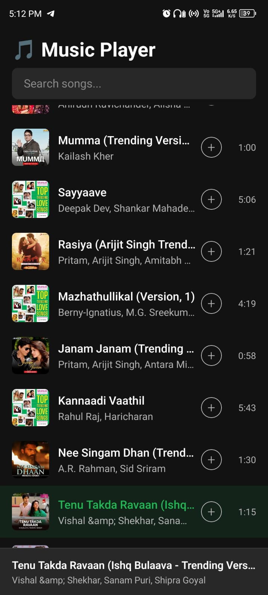
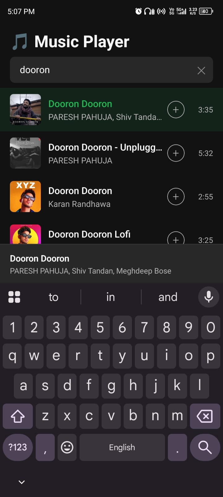
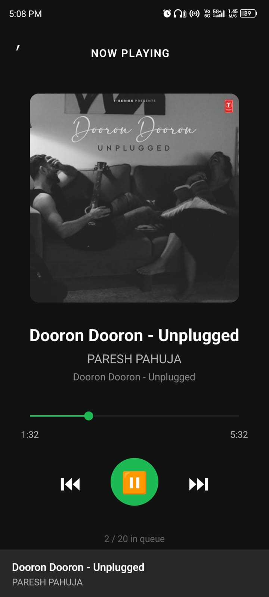

# Music Player App 🎵

A React Native (Expo) music player app built as an assignment.

## Features
- Search songs (JioSaavn API + iTunes fallback)
- Play / Pause / Next / Previous
- Mini Player
- Seek bar
- Queue management

## Tech Stack
- React Native (Expo)
- TypeScript
- Zustand (state management)
- expo-av (audio playback)
  
## Screenshots

## How to Run

npm install
npx expo start

Scan the QR code using Expo Go on your mobile device.

## Architecture
Global state handled using Zustand
Centralized audio management with a single audio instance
Navigation handled via React Navigation
Modular and reusable component structure

## Challenges Faced
Managing a single audio instance across multiple screens
Synchronizing player state between Mini Player and Full Player
Handling duplicate keys issue in FlatList
Ensuring smooth playback and avoiding audio crashes

## Future Improvements
Improved UI/UX design
Background playback enhancements
Playlist creation and management
Better error handling and performance optimizations
